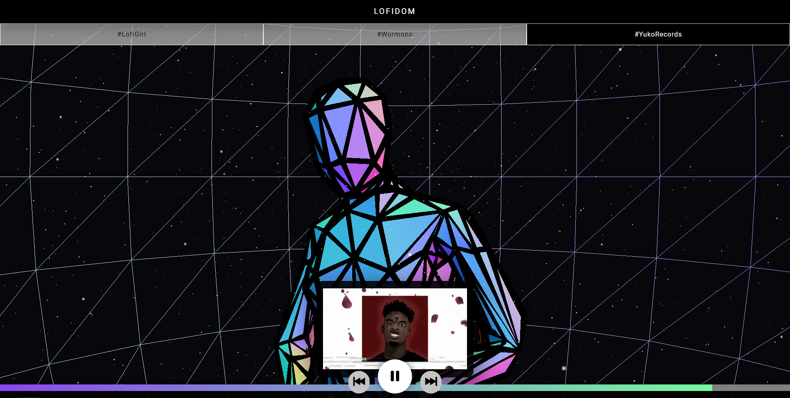

  

<h1 align="center">
  LOFIDOM
</h1>

<a href="https://lofidom.netlify.app/">View Demo</a>
|
<a href="https://github.com/gauthamkrishnax/LofiDom/issues">Report Bug</a>
 

 
 

## About The Project

 
 

- ### LofiDom is a largely music-centric aesthetic that utilizes muted tones and mundane imagery to evoke a feeling of calm and nostalgia. An Immersive Experiance to the music of Lofi.

- ### LofiDom Fetch Lofi Music from Youtube using the Youtube's Embeded API

- ### A Dom with a Dancing Model is rendered RealTime to keep up with the visual branding of Lofi Music

 
 

## Built With

1.  **Vite**

    
    
    

    Vite (French word for "quick", pronounced /vit/, like "veet") is a new breed of frontend build tool that significantly improves the frontend development experience.

2.  **PostCSS**

    PostCSS is a tool for transforming styles with JS plugins. These plugins can lint your CSS, support variables and mixins, transpile future CSS syntax, inline images, and more.

3.  **Three.js**

    [![NPM Package][npm]][npm-url]
    [![NPM Downloads][npm-downloads]][npmtrends-url]
    [![Discord][discord]][discord-url]

    The aim of the project is to create an easy to use, lightweight, cross-browser, general purpose 3D library. The current builds only include a WebGL renderer but WebGPU (experimental), SVG and CSS3D renderers are also available in the examples.

    [npm]: https://img.shields.io/npm/v/three
    [npm-url]: https://www.npmjs.com/package/three
    [build-size]: https://badgen.net/bundlephobia/minzip/three
    [build-size-url]: https://bundlephobia.com/result?p=three
    [npm-downloads]: https://img.shields.io/npm/dw/three
    [npmtrends-url]: https://www.npmtrends.com/three
    [discord]: https://img.shields.io/discord/685241246557667386
    [discord-url]: https://discord.gg/56GBJwAnUS

 
 

## Usage

Visit [Website](https://lofidom.netlify.app/). Play or Switch between Genres.
 
 

## Contributing

Contributions are what make the open source community such an amazing place to be learn, inspire, and create. Any contributions you make are **greatly appreciated**.

- If you have suggestions for adding or removing projects, feel free to [open an issue](https://github.com/ShaanCoding/ReadME-Generator/issues/new) to discuss it, or directly create a pull request after you edit the _README.md_ file with necessary changes.
- Please make sure you check your spelling and grammar.
- Create individual PR for each suggestion.
- Please also read through the [Code Of Conduct](https://github.com/ShaanCoding/ReadME-Generator/blob/main/CODE_OF_CONDUCT.md) before posting your first idea as well.

 
 

## License

Distributed under the MIT License. See  for more information.
 
 

## Authors

- [Gautham Krishna](https://github.com/gauthamkrishnax/)
   
   

## Acknowledgements

- [Gauthamkrishna](https://github.com/gauthamkrishnax/)
